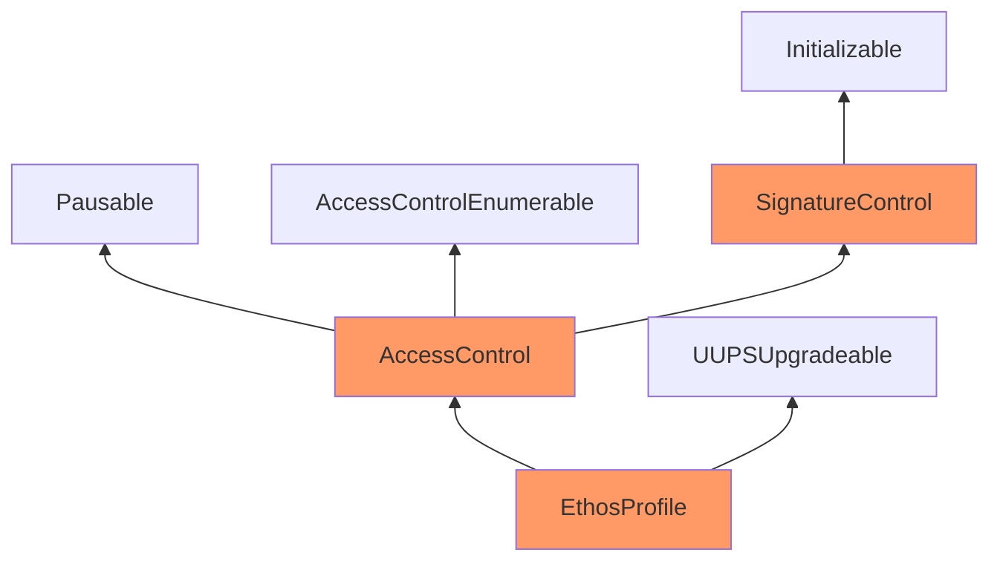

Passive Mahogany Porpoise

Medium

# Corruptible Upgradability Pattern

### Summary

Storage of `EthosAttestation.sol`, `EthosDiscussion.sol`, `EthosProfile.sol`, `EthosReview.sol`, `EthosVote.sol` might be corrupted during an upgrade.

[EthosProfile.sol](https://github.com/sherlock-audit/2024-10-ethos-network/blob/979e352d7bcdba3d0665f11c0320041ce28d1b89/ethos/packages/contracts/contracts/EthosProfile.sol#L45-L45)

### Root Cause

The project uses OpenZeppelin version 5, which incorporates a structured storage schema. In this model, each base contract defines a dedicated storage slot for its structure containing all variables necessary for its operations. The project also implements custom versions of several base classes to extend functionality according to its requirements. However, these custom base contracts do not use the structured storage pattern; instead, they define separate variables at the contract level.

The project’s inheritance hierarchy is complex and extensively leverages multiple inheritance rather than a simple linear structure. This, combined with a reliance on proxy contracts for deployment, means that updating base contracts will be challenging, if not impossible. Further complicating this is the mixture of non-upgradable and upgradable base contracts from OpenZeppelin; some are from the standard OpenZeppelin library and define their own contract-level variables without supporting upgradability.

### Internal pre-conditions

_No response_

### External pre-conditions

_No response_

### Attack Path

_No response_

### Impact

These factors create a fragmented upgradeability model, which may lead to significant issues when performing contract upgrades. Updating underlying contracts may lead to inconsistencies in the data stored in the proxy contract storage.

### PoC

Below is the inheritance diagram for `EthosProfile` , other contracts inherit analogously.

### Mitigation

To stabilize the upgradability pattern:
- Ensure structured storage usage across all base contracts.
- Switch all OpenZeppelin libraries to their upgradable versions where possible.