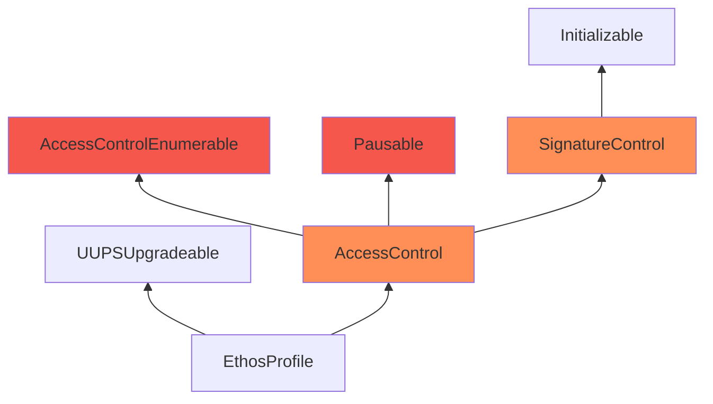

Virtual Boysenberry Swan

Medium

# Corruptible Contract's Upgradeability

### Summary

The following diagram describes the inheritance of the[ `EthosProfile`](https://github.com/sherlock-audit/2024-10-ethos-network/blob/main/ethos/packages/contracts/contracts/EthosProfile.sol), [`EthosAttestation`](https://github.com/sherlock-audit/2024-10-ethos-network/blob/main/ethos/packages/contracts/contracts/EthosAttestation.sol), [`EthosDiscussion`](https://github.com/sherlock-audit/2024-10-ethos-network/blob/main/ethos/packages/contracts/contracts/EthosDiscussion.sol) and the other `Ethos` contracts that are meant to be upgradeable, but they inherit non-upgrade-safe contracts.
The contracts in red are the incorrect versions
The contracts in orange are the ones with missing storage gap

- The first problem is that `SignatureControl` and `AccessControl` do not define gap slots. This can result in misbehaviour in future when variables are added
- The second problem is that `AccessControl` is not using the upgradeable versions of OpenZeppelin's `Pausable` and `AccessControlEnumerable` contracts. This can again lead to altering the storage layout in future updates.

### Root Cause

- In [`AccessControl.sol`](https://github.com/sherlock-audit/2024-10-ethos-network/blob/main/ethos/packages/contracts/contracts/utils/AccessControl.sol#L15) a storage gap is missing and it does not inherit the correct version of Openzeppelin's contract
- In [`SignatureControl.sol`](https://github.com/sherlock-audit/2024-10-ethos-network/blob/main/ethos/packages/contracts/contracts/utils/SignatureControl.sol#L16) a storage gap is missing

### Internal pre-conditions

_No response_

### External pre-conditions

_No response_

### Attack Path

_No response_

### Impact

The storage layout of `Ethos` contracts may be corrupted after upgrading the contracts and causing misbehaviour in the system

### PoC

_No response_

### Mitigation

Add `uint256[50] __gap;` inside `AccessControl` and `SignatureControl` to enable adding future variables.\
Replace `AccessControl`'s inherited contracts with upgradeable versions `AccessControlEnumerableUpgradeable` and `PausableUpgradeable`