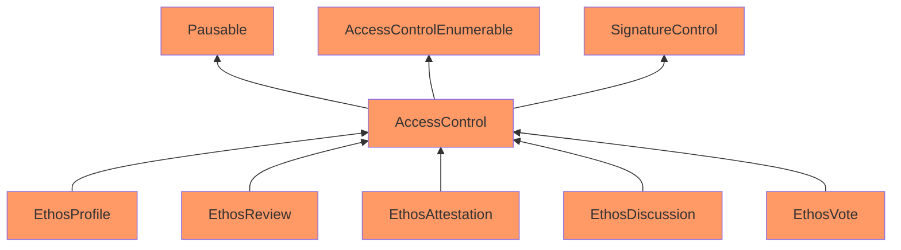

Stale Candy Wallaby

Medium

# Corruptible Upgradability Pattern

### Summary

The EthosContracts (EthosProfile, EthosReview, ...) are UUPSUpgradeable. However, the current implementation has multiple issues regarding upgradability.

### Root Cause

Following is the inheritance chain of the EthosContracts.



The Ethos contracts are meant to be upgradeable. However, it inherits contracts that are not upgrade-safe.

The `AccessControl` and `SignatureControl` are both contracts written by Ethos team, both contain storage slots but there are no gaps implemented.

Also, AccessControl inherits the non-upgradeable version Pausable and AccessControlEnumerable from Openzeppelin's library, when it should use the upgradeable version from [openzeppelin-contracts-upgradeable](https://github.com/OpenZeppelin/openzeppelin-contracts-upgradeable) lib.

https://docs.openzeppelin.com/contracts/5.x/upgradeable

There is also another issue that in all EthosContract, the constructor does not have initializers disabled for the implementation contract. This is also a best practice for proxy contracts.

```solidity
  constructor() {
    _disableInitializers();
  }
```

- https://github.com/sherlock-audit/2024-10-ethos-network/blob/main/ethos/packages/contracts/contracts/utils/AccessControl.sol#L15
- https://github.com/sherlock-audit/2024-10-ethos-network/blob/main/ethos/packages/contracts/contracts/utils/SignatureControl.sol#L11

### Internal pre-conditions

If admin performs an upgrade and wants to add another storage slot in AccessControl or SignatureControl contract, the storage slot would mess up.

### External pre-conditions

N/A

### Attack Path

N/A

### Impact

Storage of vault contracts might be corrupted during upgrading.

### PoC

N/A

### Mitigation

1. Add gaps in AccessControl, SignatureControl
2. Use library from Openzeppelin-upgradeable instead, e.g. PausableUpgradeable, AccessControlEnumerableUpgradeable.
3. Disable initializers in EthosContracts constructor.